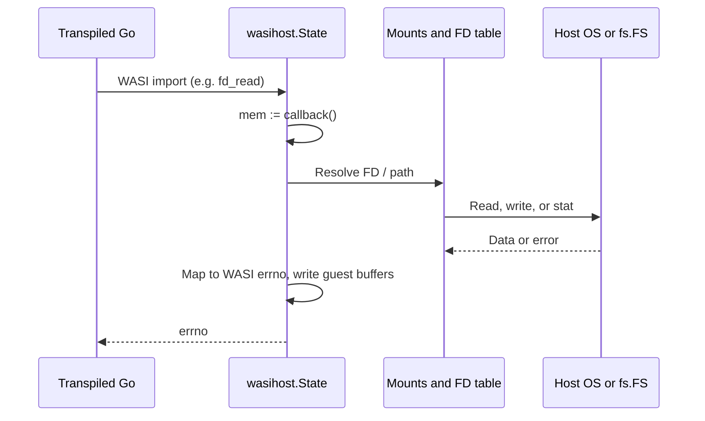
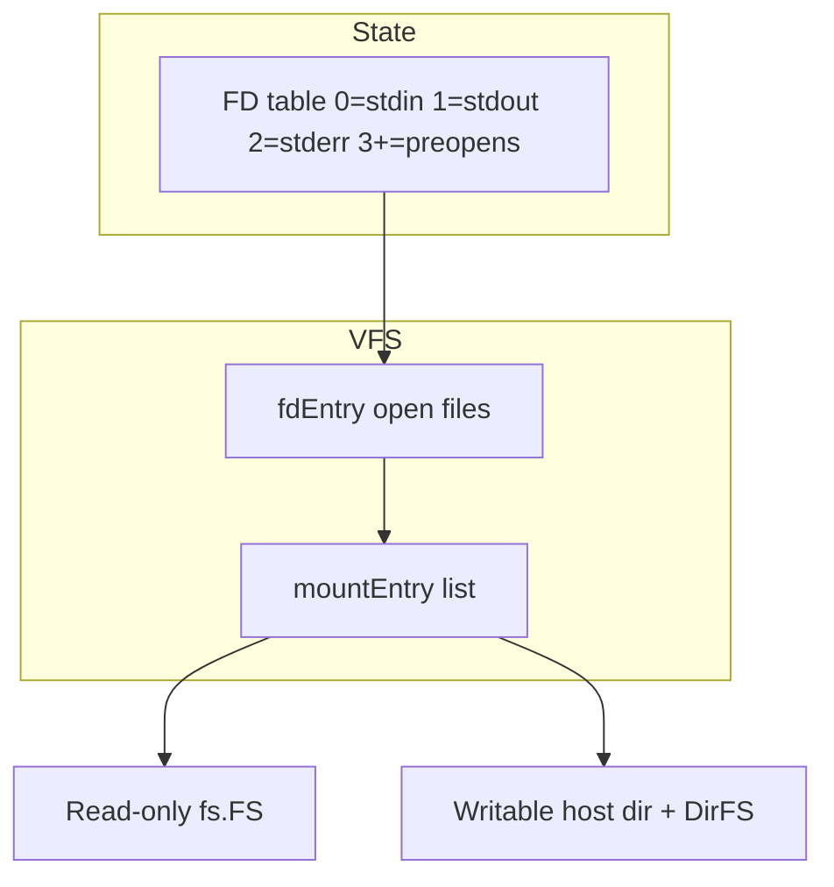

# Architecture

`wasm2go-wasi-host` has two main parts: the **`wasihost`** library (WASI Preview1 for wasm2go-generated Go) and the **`wasm2go-run`** CLI (transpile → wrap → build → run for wasi-testsuite and local development).

## Compliance

The authoritative check is the `wasi-testsuite` submodule running its full `wasm32-wasip1` inventory through `adapters/wasm2go.py` and this repository's `wasm2go-run`. All 72 Preview1 tests pass. Unit and integration tests in this repo cover path confinement, rights, symlinks, poll, and filesystem mutations; see `*_test.go` and `scripts/e2e-wasip1.sh`.

## 1. `wasihost` package

### Role

`wasihost` implements **WASI snapshot-preview1** for a single wasm2go `Module` instance. The guest is native Go; the host reads and writes guest linear memory through a callback (`func() []byte`) re-invoked on every import so memory growth stays correct.

`State` satisfies the wasm2go-generated `X…` methods for `wasi_snapshot_preview1` and `env` (including `call_host_function`, which returns zero). Guest termination uses `proc_exit`, which panics with [`ExitError`](wasihost.go); embedders recover at the `_start` boundary.

### Core structures

- **`State`**: FD table, mounts, args/env, clocks, stdio, optional tracing and goroutine-owner assertion.
- **`mountEntry`**: Guest path prefix → `fs.FS` (read path) and optional `hostRoot` (writable mutations).
- **`fdEntry`**: Open file or directory, rights, offset, preopen flag, optional `ReadDirFile` / readdir cache.

### Source file map

Portable `package wasihost` on **Linux** and **Darwin** (small build-tagged files for OS-specific behavior):

| Area | File |
|------|------|
| `State`, `New`, options, FD table | `wasihost.go` |
| WASI errno / rights constants | `wasihost_const.go` |
| `mapOSError`, errno helpers | `wasihost_errno.go` |
| `fsFile`, `osFile`, `FSFileWrap`, `DirEntriesFile` | `wasihost_adapters.go` |
| Guest memory / string tables | `wasihost_mem.go` |
| Path resolution and confinement | `wasihost_path_resolve.go` |
| `path_open` | `wasihost_open.go` |
| `path_*` mutations, `path_rename` | `wasihost_path.go` |
| `fd_read` / `write` / `seek` / `readdir` | `wasihost_fd.go` |
| `fd_pread` / `pwrite`, fd stubs | `wasihost_fd_ext.go` |
| filestat / fdstat | `wasihost_filestat.go` |
| args / env / clock / poll / proc_exit | `wasihost_misc.go` |

| Concern | Linux | Darwin |
|---------|-------|--------|
| Access time from `Stat_t` | `atime_linux.go` | `atime_darwin.go` |
| Hard link at symlink inode (`path_link`) | `path_link_linux.go` | `path_link_darwin.go` |
| `path_rename` across devices | `path_rename_unix.go` | (same file, unix tag) |
| `path_rename` on other GOOS | — | `path_rename_other.go` |

### Syscall flow

### Filesystem layer

Access is **capability-oriented**: guests use **preopened directories** only (plus FDs opened beneath them). read-only fs.FS preopens via `WithReadOnlyFS` report no write or path-mutation rights. Writable mounts use `WithHostDirectoryPreopen`: reads go through `os.DirFS`, writes and path operations use `hostRoot` with confinement checks (lexical preopen bounds, symlink follow rules, `filepath.EvalSymlinks` where required).

Path resolution (`resolvePath`, `resolveDirfdPath`, `resolveWritable`) enforces preopen and nested-directory confinement before host I/O.

## 2. `wasm2go-run` CLI

Orchestrates one-shot execution of a `.wasm` file for tests and local runs.

### Pipeline

### Responsibilities

1. **CLI** (`config.go`): `-dir`, `-env`, `-cache off`, `-version`, guest args after `--`.
2. **Transpile** (`transpile.go`, `cache.go`): invoke `wasm2go`; optional tier-1 cache of transpiled `module.go` (keyed by WASM hash, wasm2go identity, post-process version). Compile always uses a fresh temp workspace.
3. **Wrapper** (`template.go`): `main.go` calling `wasihost.New` with mounts/env/stdio and `generated.New(state, state)`; recover `ExitError`.
4. **Build path** (`compile.go`): `WASM2GO_WASIHOST_PATH` or dev `replace` to this repo; `go mod tidy` + `go build`.
5. **Execute** (`execute.go`): run binary, propagate exit code, delete temp dir.

Environment variables: `WASM2GO_RUN_CACHE`, `WASM2GO_RUN_CACHE_DIR`, `WASM2GO_WASIHOST_PATH` (see `cmd/wasm2go-run/README.md`).

### Testsuite integration

`scripts/e2e-wasip1.sh` runs `wasi-testsuite/run-tests` with `adapters/wasm2go.py`. The adapter expects `wasm2go-run` on `PATH` or via `WASM2GO_RUN`.

## Concurrency

Same as the library: one `State` per guest instance, single goroutine unless debugging with `WithOwnerAssertion`.

## Related docs

- [README.md](./README.md) — install, usage, development
- [cmd/wasm2go-run/README.md](./cmd/wasm2go-run/README.md) — CLI flags and cache
- [pkg.go.dev](https://pkg.go.dev/github.com/lbe/wasm2go-wasi-host) — generated API reference
