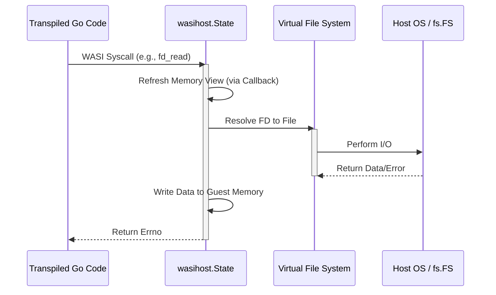
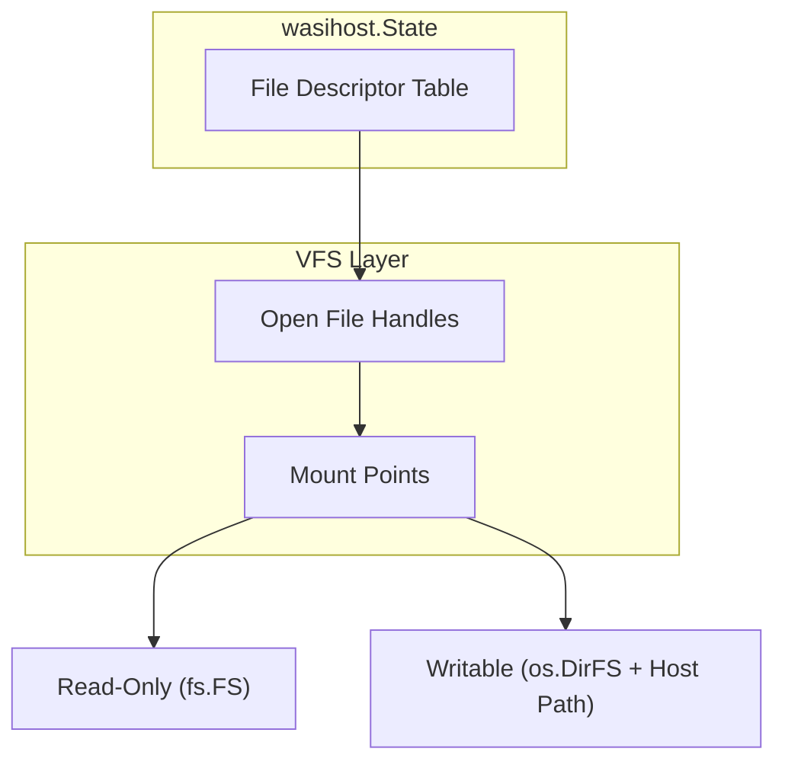
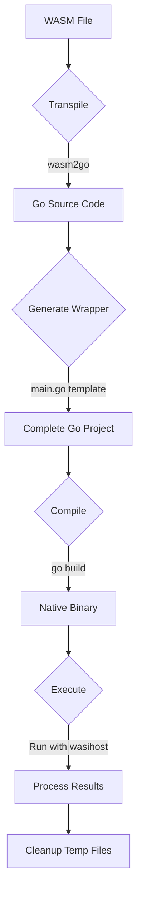
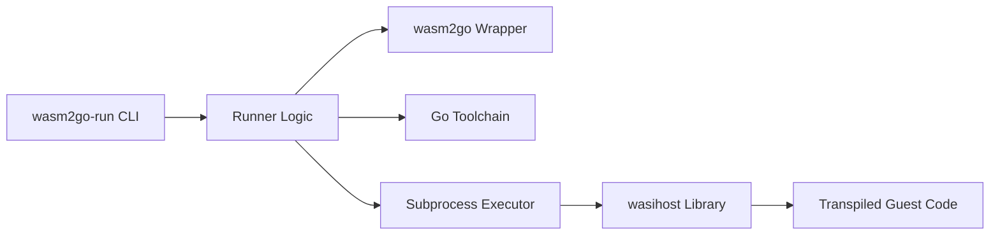

# Architecture

This document describes the architecture of the `wasm2go-wasi-host` project, which consists of two main components: the `wasihost` library and the `wasm2go-run` CLI tool.

## 1. `wasihost` Package

The `wasihost` package provides a **WASI snapshot-preview1** host implementation specifically tailored for [wasm2go](https://github.com/ncruces/wasm2go).

### High-Level Components

*   **State**: The central object managing WASI resources (file descriptors, clocks, arguments, environment variables).
*   **Virtual File System (VFS)**: Manages mappings between guest file descriptors and host files/directories or `fs.FS` instances.
*   **Memory Access**: Since `wasm2go` transpiles WASM to native Go, `wasihost` accesses guest memory directly via a callback that returns a byte slice.

### System Call Flow

The following diagram illustrates how a WASI system call is handled:

### Filesystem Layer

`wasihost` uses a capability-oriented approach. Preopened directories (including read-only fs.FS preopens and writable host directories) are mapped to guest FDs at initialization. These preopened directories provide the base capabilities for filesystem access.

---

## 2. `wasm2go-run` CLI Tool

`wasm2go-run` is an orchestration tool designed to bridge the gap between a raw `.wasm` file and the Go-based `wasihost`.

### Execution Pipeline

The tool follows a linear pipeline to execute a WebAssembly module:

### Component Interaction

### Key Responsibilities
1.  **Environment Setup**: Parses `-dir` and `-env` flags to configure the `wasihost.State` in the generated wrapper.
2.  **Code Generation**: Creates a `main.go` that:
    *   Imports the transpiled package.
    *   Initializes `wasihost`.
    *   Handles `_start` execution and `ExitError` recovery.
3.  **Lifecycle Management**: Ensures that the temporary directory used for transpilation and compilation is cleaned up, even if the guest program crashes.
