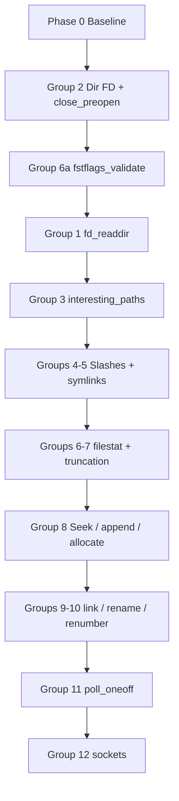

# WASI testsuite correction sequence plan

This document recommends an order for fixing the **29 failing** Preview1 tests reported in `e2e-wasip1-test-results.log` (72 run, 40 skipped). Work in **small groups** with a tight verify loop so regressions stay visible.

## Baseline

| Suite | Result |
|-------|--------|
| Assemblyscript `wasm32-wasip1` | 12/12 pass |
| Rust `wasm32-wasip1` | many failures (`!` in runner output) |
| Rust `wasm32-wasip3` | skipped |
| C `wasm32-wasip1` | 6 failures |
| **Total** | **29 failed**, 40 skipped |

The log was captured against `wasm2go-run dev (6d58ca0, dirty)`. Re-run after each group on current `main`:

```bash
go build -o ./bin/wasm2go-run ./cmd/wasm2go-run
./scripts/e2e-wasip1.sh | tee e2e-wasip1-test-results.log
```

### Single-test loop

```bash
go build -o ./bin/wasm2go-run ./cmd/wasm2go-run
cd wasi-testsuite
WASM2GO_RUN="$PWD/../bin/wasm2go-run" WASM2GO_WASIHOST_PATH="$PWD/.." \
  python3 ./run-tests -r adapters/wasm2go.py \
  tests/rust/testsuite/wasm32-wasip1/<name>.wasm
```

Most filesystem tests need `--dir` (via JSON manifest); the adapter adds that automatically when `dirs` is set in the crate manifest.

### Smoke tests (already passing — run after every group)

- `path_open_read_write`, `stdio`, `sched_yield`, `nofollow_errors`
- `path_open_missing`, `file_truncation`, `file_pread_pwrite`
- `fd_flags_set`, `fd_fdstat_set_rights`, `readlink`, `path_exists`, `overwrite_preopen`

---

## Failing tests (inventory)

### Rust `wasm32-wasip1` (23)

| Test | Primary syscall / theme |
|------|-------------------------|
| `dir_fd_op_failures` | Directory fd: read/write/seek must fail |
| `symlink_create` | `path_symlink` |
| `path_link` | `path_link` |
| `poll_oneoff_stdio` | `poll_oneoff` (stdio subscriptions) |
| `renumber` | `fd_renumber` |
| `path_filestat` | `path_filestat_get` (dev/ino) |
| `file_seek_tell` | `fd_seek` / `fd_tell` |
| `fd_advise` | `fd_advise` |
| `path_rename` | `path_rename` |
| `path_open_dirfd_not_dir` | `path_open` + non-dir dirfd |
| `fd_readdir` | `fd_readdir` (`.`, `..`, cookie, ino) |
| `symlink_filestat` | `path_filestat_get` on symlinks |
| `unlink_file_trailing_slashes` | `path_unlink_file` + `/` |
| `fstflags_validate` | `fd_filestat_set_times` flag combos |
| `file_allocate` | `fd_allocate` |
| `directory_seek` | `fd_seek` on directory fd |
| `close_preopen` | `fd_close` on preopen fd |
| `dangling_symlink` | symlink + missing target |
| `truncation_rights` | `O_TRUNC` vs rights |
| `path_symlink_trailing_slashes` | `path_symlink` + `/` |
| `fd_filestat_set` | `fd_filestat_set_times` |
| `path_open_preopen` | preopen rights / masks |
| `interesting_paths` | in-preopen `..` normalization |

### C `wasm32-wasip1` (6)

| Test | Primary theme |
|------|----------------|
| `lseek` | kernel offset vs WASI offset |
| `sock_shutdown-not_sock` | `sock_shutdown` on stdio → `ENOTSOCK` |
| `sock_shutdown-invalid_fd` | `sock_shutdown` on bad fd → `EBADF` |
| `stat-dev-ino` | filestat dev/ino |
| `fdopendir-with-access` | directory read (depends on readdir) |
| `pwrite-with-append` | `fd_pwrite` + `APPEND` |

---

## Recommended sequence

Attack in **dependency order**. Later groups assume earlier path/readdir/errno behavior.



### Phase 0 — Baseline (once)

1. Re-run `./scripts/e2e-wasip1.sh` on current `main`; save log.
2. For each failing test, run the single `.wasm` and record exit code + stderr.
3. Optionally add a `Makefile` target or script that lists the 29 tests for CI diffing.

---

### Group 1 — `fd_readdir` (high leverage)

**Tests:** `fd_readdir` (Rust), `fdopendir-with-access` (C)

**Likely gaps in `wasihost.go`:**

- No synthetic **`.` and `..`** entries (empty dir must show 2 entries).
- **`d_ino` always 0**; tests expect `d_ino == fd_filestat_get(...).ino`.
- **Cookie pagination** broken (full `ReadDir(-1)` each call; cookie not stable).
- Writable host preopen may not use a listing path that matches test expectations.

**Work:** Cache directory entries per dir fd; inject `.`/`..`; honor cookie; use host `Readdir` for writable preopens; fill `d_ino` when stat is available.

**Verify:** `fd_readdir`, then `fdopendir-with-access`.

---

### Group 2 — Directory FD semantics + preopen close ✓

**Tests:** `dir_fd_op_failures`, `directory_seek`, `path_open_dirfd_not_dir`, `close_preopen`

**Status:** Done on branch `fix-dir-fd-and-close-preopen` (TDD plan
`.pi/tdd-plans/fix-dir-fd-and-close-preopen.yaml`). Host changes: closable
preopens, `errnoForDirectoryFDOp` on byte and position/size syscalls, strip
`FD_SEEK` from directory `fdstat`, `path_open` rejects non-directory dirfds,
`fd_prestat_dir_name` returns `EINVAL` when the buffer is too small. Verified
via `group_dir_fd_test.go`, `group_a_fd_test.go`, and `e2e_group2_test.go`.

**Verify:** all four tests. **Good first PR:** `close_preopen` + `fstflags_validate` (Group 6a) before large `fd_readdir` work.

---

### Group 3 — Path normalization inside preopen

**Tests:** `interesting_paths`

**Requirements:**

- Paths like `dir/.//nested/../../dir/nested/../nested///./file` must **succeed** (stay under preopen).
- Absolute paths from dirfd (`/dir/nested/file`) → **`ENOTCAP`** / **`PERM`**.
- Trailing `/`, embedded NUL, and paths that escape preopen → correct errno.

**Work:** Separate **lexical escape** (`../` leaving root → `ENOTCAP`) from **in-preopen normalization** (`path.Clean` within the mount). Align with `preopenMountRelEscapes` and `resolveDirfdPath`.

**Verify:** `interesting_paths` before trailing-slash and symlink groups.

---

### Group 4 — Trailing slashes

**Tests:** `unlink_file_trailing_slashes`, `path_symlink_trailing_slashes`

**Depends on:** Group 3

**Work:** Trailing `/` on files → `ENOTDIR` / `NOENT`; symlink trailing-slash parity with WASI/Linux expectations.

---

### Group 5 — Symlinks

**Tests:** `symlink_create`, `symlink_filestat`, `dangling_symlink`

**Depends on:** Groups 3–4

**Work:** `path_symlink`, `path_readlink`, `path_filestat_get` with/without `SYMLINK_FOLLOW`; dangling targets; no-follow → `ELOOP` where required.

---

### Group 6 — filestat, inode, and times

**Tests:** `path_filestat`, `fd_filestat_set`, `fstflags_validate`, `stat-dev-ino` (C)

**Likely gaps:**

- `writeFilestat` sets **dev/ino = 0**.
- **`fstflags_validate`:** `MTIM | MTIM_NOW` and `ATIM | ATIM_NOW` must return **`EINVAL`**.
- Path and fd `filestat_set_times` must share flag validation.

**Work:**

1. Populate **dev/ino** from OS stat (`syscall.Stat_t` / platform build tags).
2. Reject contradictory **fstflags** before calling `Chtimes`.

**Verify:** Rust trio, then C `stat-dev-ino`.

#### Group 6a — Quick win (do early)

**Test:** `fstflags_validate` only — small, isolated; good pairing with Group 2 `close_preopen`.

---

### Group 7 — Rights and truncation

**Tests:** `truncation_rights`, `path_open_preopen`

**Work:**

- **`O_TRUNC`** via `path_open` when path truncate right is present even if `FD_FILESTAT_SET_SIZE` was dropped from inheriting.
- **`path_open_preopen`:** match test expectations for directory **rights_base** / **rights_inheriting** masks vs `rightsWritableDirPreopen`.

---

### Group 8 — Seek, append, allocate, advise

**Tests:** `file_seek_tell`, `file_allocate`, `fd_advise`, `lseek` (C), `pwrite-with-append` (C)

**Work:**

- **`fd_seek` / `fd_tell`:** file vs directory; `WHENCE` edge cases; keep WASI offset consistent with `ReadAt`/`WriteAt`.
- **`fd_allocate`:** implement or no-op per test expectations.
- **`fd_advise`:** confirm test only needs success.
- **`fd_pwrite` + `APPEND`:** with `fdFlagsAppend`, pwrite at offset 0 may need to write at EOF (extend `fd_write` APPEND behavior).
- **C `lseek`:** guest libc vs host `entry.offset`.

---

### Group 9 — `path_link` and `path_rename`

**Tests:** `path_link`, `path_rename`

**Depends on:** Groups 3–5

**Work:** Hard links, rename replace, directory not empty; map `EXDEV`, `ENOTEMPTY`, etc.

---

### Group 10 — `fd_renumber`

**Tests:** `renumber`

**Work:** Closing **`to`**, moving **`from` → `to`**, clearing **`from`**; preserve fdstat/rights on destination.

---

### Group 11 — `poll_oneoff`

**Tests:** `poll_oneoff_stdio` (no `--dir`)

**Likely gaps:**

- Sets **`nevents = nsubscriptions`** always; test expects only **signaled** events (clock fired and/or stdin ready).
- **fd_read** subscriptions do not report readiness on stdio.

**Work:** Count delivered events; treat stdio as ready for poll; correct event layout (`error`, `type`, userdata); clock timeout path.

---

### Group 12 — Sockets (C)

**Tests:** `sock_shutdown-not_sock`, `sock_shutdown-invalid_fd`

**Likely gap:** `Xsock_shutdown` returns **`ENOSYS`**; libc tests expect **`ENOTSOCK`** / **`EBADF`** via errno mapping.

**Work:** Return spec-appropriate errnos for non-socket and bad fds (confirm fd 3 semantics vs test).

**Priority:** Lower if sockets remain explicitly unsupported — but these are in the wasip1 C inventory.

---

## Suggested PR slices

| PR | Groups | ~tests fixed | Notes |
|----|--------|--------------|-------|
| 1 | 2 (`close_preopen`) + 6a (`fstflags_validate`) | 2 | Fast feedback |
| 2 | 1 (`fd_readdir`) | 1–2 | Largest single host change |
| 3 | 2 (remainder) + 3 | 4 | Dir fd + paths |
| 4 | 4–5 | 5 | Slashes + symlinks |
| 5 | 6–7 | 5 | Metadata + truncation |
| 6 | 8 | 5 | Seek / append / allocate |
| 7 | 9–10 | 3 | link / rename / renumber |
| 8 | 11–12 | 3 | poll + sockets |

**Cumulative target:** 29/29 passing on `wasm32-wasip1` for Rust + C (excluding intentional skips).

---

## Progress checklist

| Group | Tests | Done |
|-------|-------|------|
| 1 — fd_readdir | `fd_readdir`, `fdopendir-with-access` | ☑ |
| 2 — dir FD | `dir_fd_op_failures`, `directory_seek`, `path_open_dirfd_not_dir`, `close_preopen` | ☑ |
| 3 — paths | `interesting_paths` | ☐ |
| 4 — slashes | `unlink_file_trailing_slashes`, `path_symlink_trailing_slashes` | ☐ |
| 5 — symlinks | `symlink_create`, `symlink_filestat`, `dangling_symlink` | ☐ |
| 6 — filestat | `path_filestat`, `fd_filestat_set`, `fstflags_validate`, `stat-dev-ino` | ☑ |
| 7 — rights | `truncation_rights`, `path_open_preopen` | ☑ |
| 8 — seek/append | `file_seek_tell`, `file_allocate`, `fd_advise`, `lseek`, `pwrite-with-append` | ☐ |
| 9 — link/rename | `path_link`, `path_rename` | ☐ |
| 10 — renumber | `renumber` | ☐ |
| 11 — poll | `poll_oneoff_stdio` | ☐ |
| 12 — sockets | `sock_shutdown-not_sock`, `sock_shutdown-invalid_fd` | ☐ |

---

## References

- Failure log: `e2e-wasip1-test-results.log`
- E2E wrapper: `scripts/e2e-wasip1.sh`
- Test sources: `wasi-testsuite/tests/rust/wasm32-wasip1/src/bin/`, `wasi-testsuite/tests/c/`
- Host implementation: `wasihost.go`
- Follow-ups from refactor audit: `docs/ToDo.md`
